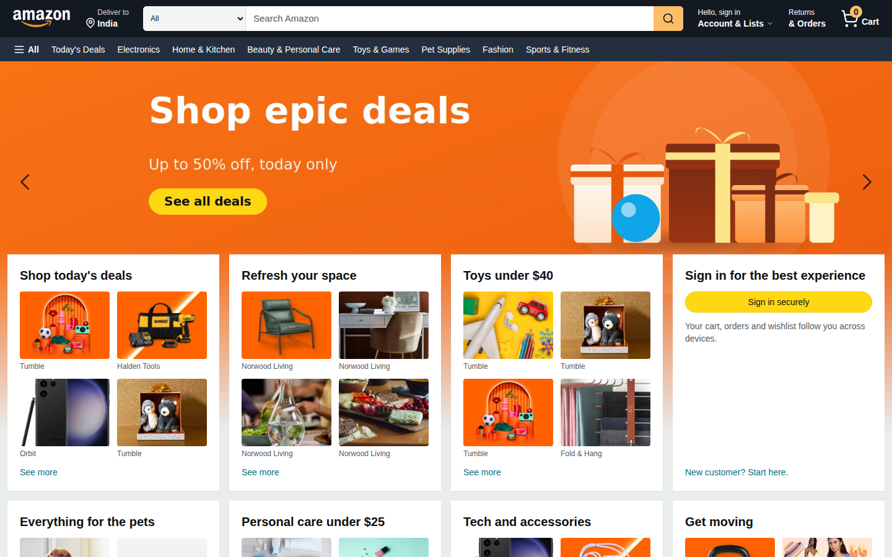

# Amazon Clone


A full-stack clone of the Amazon storefront built for a web technology course. The front end is React with React Router and Tailwind CSS; the back end is an Express API over a SQLite database. Accounts, carts, orders, stock and reviews are all real records that survive a restart and are shared across browsers, and the only thing that is simulated is the card charge itself.

Designed and built by Anshuman Agrawal. Not affiliated with Amazon.com, Inc.



## Running it

You need Node.js 18 or newer (20 recommended, see `.nvmrc`). Then:

```bash
npm install
npm run dev
```

That starts two processes: the API on http://localhost:4000 and the React app on http://localhost:5173. Open the second one. Vite proxies every `/api` request to the API so the browser only ever talks to one origin. The database is created and seeded with the catalogue the first time the API starts, at `server/data/store.db`.

Other commands:

```bash
npm test            # 44 automated tests: API, validation, cart logic, and full browser flows against a live API
npm run test:watch  # rerun tests as you edit
npm run seed        # wipe the database and reload the catalogue (clears users, orders and reviews)
npm run build       # production build of the React app into dist/
npm start           # production mode: one process serves both the API and the built app on port 4000
```

Configuration is optional and lives in a `.env` file; copy `.env.example` to see the settings (port, database path, JWT secret, admin login). Set a real `JWT_SECRET` and a real `ADMIN_PASSWORD` before deploying anywhere public.

An administrator account is created the first time the API starts. Sign in with `admin@example.com` and `admin123` (or whatever you set in `.env`) and a Store admin link appears in the navigation.

## What it does

Browsing works as you'd expect from Amazon. The home page has a three-slide hero with arrows (swipe on a phone), eight category tiles overlapping it, and three scrolling shelves: the biggest discounts, best sellers and everything under $25. The "All" button in the department bar opens the side menu with departments, programmes and account links. On a phone the header is a different component tree rather than the desktop one squeezed down: logo row with sign-in and cart, full-width search, a "Deliver to" strip and scrolling department chips, and listing pages get a Filters button that opens a bottom sheet. Every category, the deals link and the search box lead to a listing page whose filtering (department, price band, minimum rating, free delivery), sorting and search all happen on the server through query parameters, with skeleton loaders while results change. A product page shows live stock, a quantity selector capped at what's available, related items, and the reviews that customers have written.

Accounts are real. Registration hashes the password with bcrypt and returns a JWT; signing in on another device shows the same cart and the same order history. You can shop as a guest too, and if you sign in with items in your cart they merge into the account cart. The cart is stored server-side for signed-in users and in the browser for guests.

Ordering is transactional. Checkout validates every field inline (card number formatting and Luhn check, real future expiry, and so on), then the server validates again, checks every line against current stock inside a single database transaction, and either records the whole order and decrements stock or rejects it with a specific message about which product ran short. Guests can check out and reopen their confirmation; account holders see everything under Returns & Orders.

Reviews are the other customer write path. A signed-in customer can rate and review a product once (submitting again updates it), and the product's displayed rating and review count combine the seeded figures with real reviews, so a one-star review visibly moves the average.

Around that core, the account side is filled in. Every signed-in customer has an account page for changing their name and password and keeping an address book; the default address is applied at checkout automatically and any address entered at checkout can be saved with one tick. There's a wishlist, reachable from the heart on every product card and product page. Orders carry a status (confirmed, shipped, delivered, cancelled) and a customer can cancel an order while it is still confirmed, which returns the stock. The header has an account menu and search suggestions that query the API as you type.

The store also has an admin side at `/admin`, visible only to the admin role. The dashboard shows revenue, order counts by status, customer count, low-stock products and recent orders. Products can be created, edited, restocked inline from the table, and deleted; a product that appears in a past order is archived rather than removed so order history stays intact. Orders can be moved through their statuses, and marking one cancelled restores stock the same way a customer cancellation does. There's a customer list with order counts and total spend.

## How the code is organised

```
server/
  index.js            starts the API (and serves dist/ in production)
  app.js              Express app factory, used by index.js and the tests
  db.js               schema, seeding, reset
  auth.js             JWT sign/verify middleware
  products.js         product queries with combined ratings
  routes/             products (catalogue, reviews, wishlist, admin CRUD), auth (accounts, addresses), cart, orders (checkout, cancellation, admin status)
  test/api.test.js    API tests with supertest and an in-memory database
src/
  main.jsx            entry point, wraps the app in Router and providers
  App.jsx             route table
  api.js              the one place the front end calls fetch
  hooks/useFetch.js   loading, error and reload state for GET requests
  context/            CartContext (server sync, merge on sign-in), UserContext (JWT session), WishlistContext
  components/         Header (desktop and phone trees), SideMenu, HeroCarousel, ProductCarousel, ProductCard, FilterSidebar, Reviews, ...
  hooks/useMediaQuery.js  matchMedia hook behind the phone layouts (reports false in jsdom, so tests see the desktop tree)
  pages/              one file per route; pages/admin holds the management screens
  utils/              validation (shared with the server), formatting, storage
  data/products.js    seed catalogue and category list (the server loads this into SQLite)
  test/               Vitest specs; globalSetup starts a real API for the browser-flow tests
public/images/        product photos, plus banners and three product illustrations rendered by the scripts below
scripts/              spa-fallback.mjs (404.html for static hosts), make-banners.py (hero slides and promo strip), make-product-art.py (product illustrations)
docs/                 screenshots used in this README
```

Two things are worth pointing out in a report. `src/utils/validation.js` is imported by both the React checkout form and the Express orders route, so the same rules run in the browser for instant feedback and again on the server where they cannot be bypassed. And `server/routes/orders.js` places the order inside a SQLite transaction with a conditional `UPDATE ... WHERE stock >= ?`, which is what stops two people buying the last unit at the same time.

## API summary

All endpoints are under `/api` and return JSON. Protected ones expect `Authorization: Bearer <token>`.

```
GET  /health
GET  /categories
GET  /products?q=&category=a,b&minPrice=&maxPrice=&minRating=&prime=1&deals=1&sort=featured|low|high|rating|discount&limit=
GET  /products/:id
GET  /products/:id/reviews
POST /products/:id/reviews         {rating, title, body}           (auth)
POST /auth/register                {name, email, password}
POST /auth/login                   {email, password}
GET  /auth/me                                                      (auth)
GET  /cart                                                         (auth)
PUT  /cart                         {lines: [{id, qty}]}            (auth)
POST /cart/merge                   {lines: [{id, qty}]}            (auth)
POST /orders                       {customer: {...}, lines: [...]} (guest or auth)
GET  /orders                                                       (auth)
GET  /orders/:id                                                   (owner, admin, or guest order)
POST /orders/:id/cancel                                            (owner, while confirmed)
PATCH /account                     {name}                          (auth)
POST /account/password             {current, next}                 (auth)
GET/POST /account/addresses        {label, name, line1, city, state, zip, isDefault}  (auth)
POST /account/addresses/:id/default, DELETE /account/addresses/:id (auth)
GET/POST /wishlist, DELETE /wishlist/:productId                    (auth)
GET  /admin/stats, /admin/orders?status=, /admin/customers         (admin)
PATCH /admin/orders/:id            {status}                        (admin)
GET/POST /admin/products, PATCH/DELETE /admin/products/:id         (admin)
```

Validation failures come back as `400 {error, fields: {fieldName: message}}`, stock problems as `409`, and missing sign-in as `401`.

## Testing

`npm test` runs four suites: the API through supertest against an in-memory database (including admin, wishlist, addresses and cancellation), the validation rules, the cart reducer, and twelve browser-level flows rendered with Testing Library against a real API started on port 4999 (registration, search, add to cart, a failed then successful checkout, stock reduction, reviews, wishlist, address book, order cancellation, and an admin adding a product that then appears in the store). `TESTING.md` is a manual walkthrough for checking the same things by hand in a browser, including the multi-device cart check that automated tests cannot easily show.

## Deploying

The back end needs a Node host, so GitHub Pages is not enough on its own. The simplest route is Render's free tier: push to GitHub, create a new Blueprint on Render and point it at the repository, and it reads `render.yaml`, which sets the build and start commands, generates a JWT secret and mounts a small disk so the SQLite file persists between deploys. Railway and Fly work the same way with `npm ci && npm run build` as the build step and `npm start` as the start command.

The CI workflow in `.github/workflows/ci.yml` runs the tests and a build on every push and pull request.

## History

Version 1 was sixteen static HTML files with a JavaScript error on the landing page, hot-linked images that had started to expire, and a payment form posting to a URL that did not exist. Version 2 rebuilt it in React with a single data file. Version 3 added the Express and SQLite back end with accounts, server-side carts, transactional orders, reviews and server-side search. Version 4 completed the store: account management, address book, wishlist, order statuses and cancellation, search suggestions, and the full admin area for products, orders and customers. Version 5 is the visual pass: an Amazon-style hero carousel and product shelves, the side menu, a dedicated phone header and filter sheet, full-width listing pages, pill buttons, a breadcrumb and a proper buy-box layout on the product page, and an Amazon-style footer. Every banner is now original artwork generated by `scripts/make-banners.py`, so the repository carries no third-party marketing images; every product has an image; the checkout notice says what actually happens to the order.

## Licence

MIT, see `LICENSE`. The Amazon name and logo are trademarks of Amazon.com, Inc. and are used here only to identify what this student project imitates. The hero slides, promo strip and three product illustrations are original and generated by the scripts in `scripts/`; the remaining product photographs came with the original coursework and are included for demonstration only.
